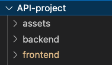
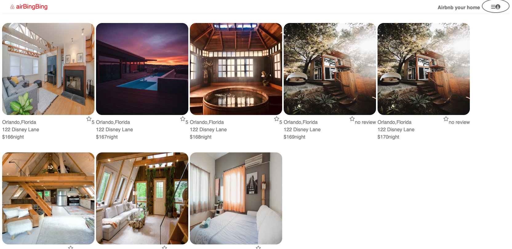
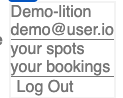

  # Intro section about your project.
    This is a full stack project. The project uses SQL database in the backend and React in the frontend to simulate the popular company: Airbnb's website. This project will allow for the creation, display, updating and deletion of spots and booking. Regarding the API documentation, please refer to the README in the backend folder.
      

  # List of technologies used on the project.
    Frontend:
      Javascript
      React
      Redux
      Redux Thunk
    Backend:
      SQL
      Express
      Sequelize

  # Pictures that are labeled that showcase your project.
  ## The file structure for this project

  ## the website outlooks
  

  ## Navigation bar
    

    # Getting Started
    Make sure you are using Node version 16!
    1. Download or clone the repository
    2. cd into backend folder run npm install
    3. cd into frontend folder run npm install

    ## To check this project in the browser, run:
    1. npm start backend folder
    2. npm start frontend folder
    3. Navigate to localhost:3000

